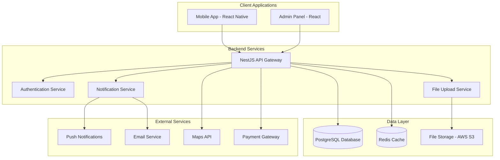

# Design Document - Mascota Hogar

## Overview

Mascota Hogar es una plataforma integrada que conecta el ecosistema completo de tenencia de mascotas en Latinoamérica. La arquitectura está diseñada como un monorepo con tres aplicaciones principales: una aplicación móvil React Native para usuarios finales, un panel de administración web en React, y un backend robusto en NestJS que sirve como API central.

La plataforma implementa un enfoque de "ecosistema unificado" donde cada componente se integra seamlessly para proporcionar una experiencia de usuario fluida desde la adopción hasta el cuidado diario de mascotas, incluyendo la búsqueda de vivienda pet-friendly.

## Architecture

### High-Level Architecture



### Technology Stack

**Frontend (Mobile):**
- React Native 0.79.5 con Expo SDK 53
- TypeScript para type safety
- React Navigation para navegación
- React Query para state management y caching
- React Hook Form para manejo de formularios
- Expo Notifications para push notifications

**Frontend (Admin):**
- React 19.1.0 con TypeScript
- Material-UI o Ant Design para componentes
- React Router para navegación
- React Query para data fetching
- Recharts para visualización de datos

**Backend:**
- NestJS 11.0.1 con TypeScript
- PostgreSQL como base de datos principal
- Redis para caching y sesiones
- Prisma ORM para database management
- JWT para autenticación
- AWS S3 para almacenamiento de archivos
- Bull Queue para procesamiento asíncrono

**Infrastructure:**
- Docker para containerización
- AWS/DigitalOcean para hosting
- CloudFront para CDN
- GitHub Actions para CI/CD

## Components and Interfaces

### Core Modules

#### 1. User Management Module

**Entities:**
```typescript
interface User {
  id: string;
  email: string;
  password: string; // hashed
  firstName: string;
  lastName: string;
  phone?: string;
  location: Location;
  userType: UserType; // ADOPTER, OWNER, SHELTER, ADMIN
  isVerified: boolean;
  createdAt: Date;
  updatedAt: Date;
}

interface UserProfile {
  userId: string;
  avatar?: string;
  bio?: string;
  preferences: UserPreferences;
  socialLinks?: SocialLinks;
}
```

**Services:**
- UserService: CRUD operations, profile management
- AuthService: JWT authentication, password reset
- VerificationService: Email/phone verification

#### 2. Pet Management Module

**Entities:**
```typescript
interface Pet {
  id: string;
  name: string;
  species: Species; // DOG, CAT, OTHER
  breed?: string;
  age: number;
  size: PetSize; // SMALL, MEDIUM, LARGE
  gender: Gender;
  isNeutered: boolean;
  photos: string[];
  description: string;
  healthInfo: HealthInfo;
  temperament: string[];
  ownerId?: string;
  shelterId?: string;
  status: PetStatus; // AVAILABLE, ADOPTED, PENDING
  location: Location;
  createdAt: Date;
  updatedAt: Date;
}

interface HealthInfo {
  vaccinations: Vaccination[];
  medications: Medication[];
  allergies: string[];
  medicalHistory: MedicalRecord[];
  lastVetVisit?: Date;
  nextVetVisit?: Date;
}

interface Vaccination {
  id: string;
  name: string;
  date: Date;
  nextDue?: Date;
  veterinarian: string;
  batchNumber?: string;
}
```

**Services:**
- PetService: Pet CRUD, health tracking
- AdoptionService: Adoption process management
- ReminderService: Health reminders and notifications

#### 3. Housing Module

**Entities:**
```typescript
interface Property {
  id: string;
  title: string;
  description: string;
  type: PropertyType; // APARTMENT, HOUSE, ROOM
  address: Address;
  coordinates: Coordinates;
  rent: number;
  deposit: number;
  petDeposit?: number;
  photos: string[];
  amenities: string[];
  petPolicy: PetPolicy;
  ownerId: string;
  isActive: boolean;
  isVerified: boolean;
  createdAt: Date;
  updatedAt: Date;
}

interface PetPolicy {
  allowsPets: boolean;
  allowedPetTypes: Species[];
  maxPetSize: PetSize;
  maxPetCount: number;
  restrictions: string[];
  additionalFees: PetFee[];
}

interface PetFee {
  type: FeeType; // DEPOSIT, MONTHLY, ONE_TIME
  amount: number;
  description: string;
}
```

**Services:**
- PropertyService: Property CRUD, search and filtering
- VerificationService: Property verification process
- MatchingService: Pet-property compatibility matching

#### 4. Communication Module

**Entities:**
```typescript
interface Conversation {
  id: string;
  participants: string[]; // user IDs
  type: ConversationType; // ADOPTION, RENTAL, GENERAL
  relatedEntityId?: string; // pet or property ID
  lastMessage?: Message;
  createdAt: Date;
  updatedAt: Date;
}

interface Message {
  id: string;
  conversationId: string;
  senderId: string;
  content: string;
  type: MessageType; // TEXT, IMAGE, DOCUMENT
  attachments?: string[];
  isRead: boolean;
  createdAt: Date;
}
```

**Services:**
- MessageService: Real-time messaging
- NotificationService: Push and email notifications
- ModerationService: Content moderation

#### 5. Community Module

**Entities:**
```typescript
interface Post {
  id: string;
  authorId: string;
  content: string;
  images?: string[];
  type: PostType; // STORY, TIP, EVENT, QUESTION
  tags: string[];
  location?: Location;
  likes: number;
  comments: Comment[];
  isPublic: boolean;
  createdAt: Date;
  updatedAt: Date;
}

interface Event {
  id: string;
  organizerId: string;
  title: string;
  description: string;
  location: Location;
  startDate: Date;
  endDate: Date;
  maxAttendees?: number;
  attendees: string[]; // user IDs
  tags: string[];
  isPublic: boolean;
}
```

**Services:**
- CommunityService: Social features management
- EventService: Event creation and management
- ModerationService: Content and user moderation

### API Design

#### RESTful Endpoints Structure

```
/api/v1
├── /auth
│   ├── POST /register
│   ├── POST /login
│   ├── POST /refresh
│   ├── POST /forgot-password
│   └── POST /reset-password
├── /users
│   ├── GET /profile
│   ├── PUT /profile
│   ├── POST /verify-email
│   └── POST /verify-phone
├── /pets
│   ├── GET / (search & filter)
│   ├── POST /
│   ├── GET /:id
│   ├── PUT /:id
│   ├── DELETE /:id
│   ├── POST /:id/adopt
│   └── GET /:id/health-records
├── /properties
│   ├── GET / (search & filter)
│   ├── POST /
│   ├── GET /:id
│   ├── PUT /:id
│   ├── DELETE /:id
│   └── POST /:id/contact
├── /messages
│   ├── GET /conversations
│   ├── POST /conversations
│   ├── GET /conversations/:id/messages
│   └── POST /conversations/:id/messages
├── /community
│   ├── GET /posts
│   ├── POST /posts
│   ├── GET /events
│   ├── POST /events
│   └── POST /posts/:id/like
└── /admin
    ├── GET /dashboard
    ├── GET /users
    ├── GET /reports
    └── POST /moderate
```

#### WebSocket Events

```typescript
// Real-time messaging
interface SocketEvents {
  'message:new': (message: Message) => void;
  'message:read': (messageId: string) => void;
  'conversation:typing': (conversationId: string, userId: string) => void;
  
  // Live updates
  'pet:adopted': (petId: string) => void;
  'property:rented': (propertyId: string) => void;
  
  // Notifications
  'notification:new': (notification: Notification) => void;
}
```

## Data Models

### Database Schema Design

```sql
-- Users and Authentication
CREATE TABLE users (
    id UUID PRIMARY KEY DEFAULT gen_random_uuid(),
    email VARCHAR(255) UNIQUE NOT NULL,
    password_hash VARCHAR(255) NOT NULL,
    first_name VARCHAR(100) NOT NULL,
    last_name VARCHAR(100) NOT NULL,
    phone VARCHAR(20),
    user_type VARCHAR(20) NOT NULL CHECK (user_type IN ('ADOPTER', 'OWNER', 'SHELTER', 'ADMIN')),
    is_verified BOOLEAN DEFAULT FALSE,
    is_active BOOLEAN DEFAULT TRUE,
    created_at TIMESTAMP DEFAULT CURRENT_TIMESTAMP,
    updated_at TIMESTAMP DEFAULT CURRENT_TIMESTAMP
);

-- User Profiles
CREATE TABLE user_profiles (
    user_id UUID PRIMARY KEY REFERENCES users(id) ON DELETE CASCADE,
    avatar_url VARCHAR(500),
    bio TEXT,
    location_lat DECIMAL(10, 8),
    location_lng DECIMAL(11, 8),
    location_address TEXT,
    preferences JSONB,
    social_links JSONB,
    created_at TIMESTAMP DEFAULT CURRENT_TIMESTAMP,
    updated_at TIMESTAMP DEFAULT CURRENT_TIMESTAMP
);

-- Pets
CREATE TABLE pets (
    id UUID PRIMARY KEY DEFAULT gen_random_uuid(),
    name VARCHAR(100) NOT NULL,
    species VARCHAR(20) NOT NULL CHECK (species IN ('DOG', 'CAT', 'OTHER')),
    breed VARCHAR(100),
    age INTEGER,
    size VARCHAR(20) CHECK (size IN ('SMALL', 'MEDIUM', 'LARGE')),
    gender VARCHAR(10) CHECK (gender IN ('MALE', 'FEMALE', 'UNKNOWN')),
    is_neutered BOOLEAN,
    photos TEXT[], -- Array of photo URLs
    description TEXT,
    temperament TEXT[],
    owner_id UUID REFERENCES users(id),
    shelter_id UUID REFERENCES users(id),
    status VARCHAR(20) DEFAULT 'AVAILABLE' CHECK (status IN ('AVAILABLE', 'ADOPTED', 'PENDING')),
    location_lat DECIMAL(10, 8),
    location_lng DECIMAL(11, 8),
    location_address TEXT,
    created_at TIMESTAMP DEFAULT CURRENT_TIMESTAMP,
    updated_at TIMESTAMP DEFAULT CURRENT_TIMESTAMP
);

-- Pet Health Records
CREATE TABLE pet_health_records (
    id UUID PRIMARY KEY DEFAULT gen_random_uuid(),
    pet_id UUID REFERENCES pets(id) ON DELETE CASCADE,
    record_type VARCHAR(50) NOT NULL, -- 'VACCINATION', 'MEDICATION', 'VET_VISIT', 'ALLERGY'
    title VARCHAR(200) NOT NULL,
    description TEXT,
    date DATE NOT NULL,
    next_due_date DATE,
    veterinarian VARCHAR(200),
    notes TEXT,
    created_at TIMESTAMP DEFAULT CURRENT_TIMESTAMP
);

-- Properties
CREATE TABLE properties (
    id UUID PRIMARY KEY DEFAULT gen_random_uuid(),
    title VARCHAR(200) NOT NULL,
    description TEXT,
    property_type VARCHAR(20) NOT NULL CHECK (property_type IN ('APARTMENT', 'HOUSE', 'ROOM')),
    address TEXT NOT NULL,
    coordinates POINT NOT NULL,
    rent DECIMAL(10, 2) NOT NULL,
    deposit DECIMAL(10, 2),
    pet_deposit DECIMAL(10, 2),
    photos TEXT[],
    amenities TEXT[],
    pet_policy JSONB NOT NULL,
    owner_id UUID REFERENCES users(id) NOT NULL,
    is_active BOOLEAN DEFAULT TRUE,
    is_verified BOOLEAN DEFAULT FALSE,
    created_at TIMESTAMP DEFAULT CURRENT_TIMESTAMP,
    updated_at TIMESTAMP DEFAULT CURRENT_TIMESTAMP
);

-- Conversations and Messages
CREATE TABLE conversations (
    id UUID PRIMARY KEY DEFAULT gen_random_uuid(),
    participants UUID[] NOT NULL,
    conversation_type VARCHAR(20) CHECK (conversation_type IN ('ADOPTION', 'RENTAL', 'GENERAL')),
    related_entity_id UUID, -- pet or property ID
    created_at TIMESTAMP DEFAULT CURRENT_TIMESTAMP,
    updated_at TIMESTAMP DEFAULT CURRENT_TIMESTAMP
);

CREATE TABLE messages (
    id UUID PRIMARY KEY DEFAULT gen_random_uuid(),
    conversation_id UUID REFERENCES conversations(id) ON DELETE CASCADE,
    sender_id UUID REFERENCES users(id) NOT NULL,
    content TEXT NOT NULL,
    message_type VARCHAR(20) DEFAULT 'TEXT' CHECK (message_type IN ('TEXT', 'IMAGE', 'DOCUMENT')),
    attachments TEXT[],
    is_read BOOLEAN DEFAULT FALSE,
    created_at TIMESTAMP DEFAULT CURRENT_TIMESTAMP
);

-- Community Posts
CREATE TABLE posts (
    id UUID PRIMARY KEY DEFAULT gen_random_uuid(),
    author_id UUID REFERENCES users(id) NOT NULL,
    content TEXT NOT NULL,
    images TEXT[],
    post_type VARCHAR(20) CHECK (post_type IN ('STORY', 'TIP', 'EVENT', 'QUESTION')),
    tags TEXT[],
    location_lat DECIMAL(10, 8),
    location_lng DECIMAL(11, 8),
    likes_count INTEGER DEFAULT 0,
    comments_count INTEGER DEFAULT 0,
    is_public BOOLEAN DEFAULT TRUE,
    created_at TIMESTAMP DEFAULT CURRENT_TIMESTAMP,
    updated_at TIMESTAMP DEFAULT CURRENT_TIMESTAMP
);

-- Indexes for performance
CREATE INDEX idx_pets_location ON pets USING GIST(ST_Point(location_lng, location_lat));
CREATE INDEX idx_properties_location ON properties USING GIST(coordinates);
CREATE INDEX idx_pets_status ON pets(status);
CREATE INDEX idx_properties_active ON properties(is_active, is_verified);
CREATE INDEX idx_messages_conversation ON messages(conversation_id, created_at);
```

## Error Handling

### Error Response Format

```typescript
interface ApiError {
  success: false;
  error: {
    code: string;
    message: string;
    details?: any;
    timestamp: string;
    path: string;
  };
}

interface ApiSuccess<T> {
  success: true;
  data: T;
  meta?: {
    pagination?: PaginationMeta;
    filters?: any;
  };
}
```

### Error Categories

1. **Validation Errors (400)**
   - Invalid input data
   - Missing required fields
   - Format validation failures

2. **Authentication Errors (401)**
   - Invalid credentials
   - Expired tokens
   - Missing authentication

3. **Authorization Errors (403)**
   - Insufficient permissions
   - Resource access denied

4. **Not Found Errors (404)**
   - Resource not found
   - Invalid endpoints

5. **Business Logic Errors (422)**
   - Pet already adopted
   - Property not available
   - User already verified

6. **Rate Limiting (429)**
   - Too many requests
   - API quota exceeded

7. **Server Errors (500)**
   - Database connection issues
   - External service failures
   - Unexpected errors

### Global Exception Filter

```typescript
@Catch()
export class GlobalExceptionFilter implements ExceptionFilter {
  catch(exception: unknown, host: ArgumentsHost) {
    const ctx = host.switchToHttp();
    const response = ctx.getResponse<Response>();
    const request = ctx.getRequest<Request>();

    let status = HttpStatus.INTERNAL_SERVER_ERROR;
    let message = 'Internal server error';
    let code = 'INTERNAL_ERROR';

    if (exception instanceof HttpException) {
      status = exception.getStatus();
      const exceptionResponse = exception.getResponse();
      
      if (typeof exceptionResponse === 'object') {
        message = exceptionResponse['message'] || message;
        code = exceptionResponse['code'] || code;
      }
    }

    const errorResponse: ApiError = {
      success: false,
      error: {
        code,
        message,
        timestamp: new Date().toISOString(),
        path: request.url,
      },
    };

    response.status(status).json(errorResponse);
  }
}
```

## Testing Strategy

### Testing Pyramid

1. **Unit Tests (70%)**
   - Service layer logic
   - Utility functions
   - Data transformations
   - Validation logic

2. **Integration Tests (20%)**
   - API endpoints
   - Database operations
   - External service integrations
   - Authentication flows

3. **End-to-End Tests (10%)**
   - Critical user journeys
   - Cross-platform compatibility
   - Performance benchmarks

### Testing Tools and Setup

**Backend Testing:**
```typescript
// Jest configuration for NestJS
export default {
  moduleFileExtensions: ['js', 'json', 'ts'],
  rootDir: 'src',
  testRegex: '.*\\.spec\\.ts$',
  transform: {
    '^.+\\.(t|j)s$': 'ts-jest',
  },
  collectCoverageFrom: [
    '**/*.(t|j)s',
    '!**/*.spec.ts',
    '!**/node_modules/**',
  ],
  coverageDirectory: '../coverage',
  testEnvironment: 'node',
  setupFilesAfterEnv: ['<rootDir>/test/setup.ts'],
};

// Example service test
describe('PetService', () => {
  let service: PetService;
  let repository: Repository<Pet>;

  beforeEach(async () => {
    const module = await Test.createTestingModule({
      providers: [
        PetService,
        {
          provide: getRepositoryToken(Pet),
          useClass: Repository,
        },
      ],
    }).compile();

    service = module.get<PetService>(PetService);
    repository = module.get<Repository<Pet>>(getRepositoryToken(Pet));
  });

  it('should create a pet successfully', async () => {
    const petData = {
      name: 'Buddy',
      species: Species.DOG,
      age: 2,
    };

    jest.spyOn(repository, 'save').mockResolvedValue(petData as Pet);

    const result = await service.create(petData);
    expect(result.name).toBe('Buddy');
  });
});
```

**Frontend Testing:**
```typescript
// React Native testing with Jest and React Native Testing Library
import { render, fireEvent, waitFor } from '@testing-library/react-native';
import { PetListScreen } from '../PetListScreen';

describe('PetListScreen', () => {
  it('should display pets when loaded', async () => {
    const mockPets = [
      { id: '1', name: 'Buddy', species: 'DOG' },
      { id: '2', name: 'Whiskers', species: 'CAT' },
    ];

    const { getByText } = render(<PetListScreen />);

    await waitFor(() => {
      expect(getByText('Buddy')).toBeTruthy();
      expect(getByText('Whiskers')).toBeTruthy();
    });
  });

  it('should filter pets by species', async () => {
    const { getByTestId, getByText, queryByText } = render(<PetListScreen />);

    fireEvent.press(getByTestId('filter-dogs'));

    await waitFor(() => {
      expect(getByText('Buddy')).toBeTruthy();
      expect(queryByText('Whiskers')).toBeNull();
    });
  });
});
```

### Performance Testing

1. **Load Testing**
   - API endpoint performance under load
   - Database query optimization
   - Concurrent user handling

2. **Mobile Performance**
   - App startup time
   - Memory usage monitoring
   - Battery consumption testing
   - Network efficiency

3. **Monitoring and Alerting**
   - Application performance monitoring (APM)
   - Error tracking and reporting
   - User experience metrics

## Security Considerations

### Authentication and Authorization

1. **JWT Implementation**
   - Access tokens (15 minutes expiry)
   - Refresh tokens (7 days expiry)
   - Token rotation on refresh
   - Secure token storage

2. **Password Security**
   - bcrypt hashing with salt rounds ≥ 12
   - Password strength requirements
   - Rate limiting on login attempts
   - Account lockout after failed attempts

3. **Role-Based Access Control (RBAC)**
   ```typescript
   enum UserRole {
     ADOPTER = 'adopter',
     SHELTER = 'shelter',
     PROPERTY_OWNER = 'property_owner',
     ADMIN = 'admin',
     SUPER_ADMIN = 'super_admin'
   }

   @UseGuards(JwtAuthGuard, RolesGuard)
   @Roles(UserRole.ADMIN, UserRole.SUPER_ADMIN)
   @Get('/admin/users')
   async getUsers() {
     // Admin-only endpoint
   }
   ```

### Data Protection

1. **Input Validation and Sanitization**
   - DTO validation with class-validator
   - SQL injection prevention
   - XSS protection
   - File upload validation

2. **Data Encryption**
   - Sensitive data encryption at rest
   - TLS 1.3 for data in transit
   - Environment variable protection
   - Database connection encryption

3. **Privacy Compliance**
   - GDPR compliance for EU users
   - Data anonymization for analytics
   - User consent management
   - Right to be forgotten implementation

### API Security

1. **Rate Limiting**
   ```typescript
   @UseGuards(ThrottlerGuard)
   @Throttle(10, 60) // 10 requests per minute
   @Post('/auth/login')
   async login(@Body() loginDto: LoginDto) {
     // Login logic
   }
   ```

2. **CORS Configuration**
   ```typescript
   app.enableCors({
     origin: process.env.ALLOWED_ORIGINS?.split(',') || ['http://localhost:3000'],
     credentials: true,
     methods: ['GET', 'POST', 'PUT', 'DELETE', 'PATCH'],
     allowedHeaders: ['Content-Type', 'Authorization'],
   });
   ```

3. **Request Validation**
   - Helmet.js for security headers
   - Request size limiting
   - Content type validation
   - API versioning

### File Upload Security

1. **File Validation**
   - File type restrictions (images only for photos)
   - File size limits (max 5MB per image)
   - Virus scanning integration
   - Metadata stripping

2. **Storage Security**
   - Signed URLs for S3 access
   - CDN integration with access controls
   - Automatic image optimization
   - Backup and versioning

This comprehensive design document provides the foundation for implementing Mascota Hogar as a robust, scalable, and secure platform that addresses all the requirements while leveraging modern technologies and best practices.